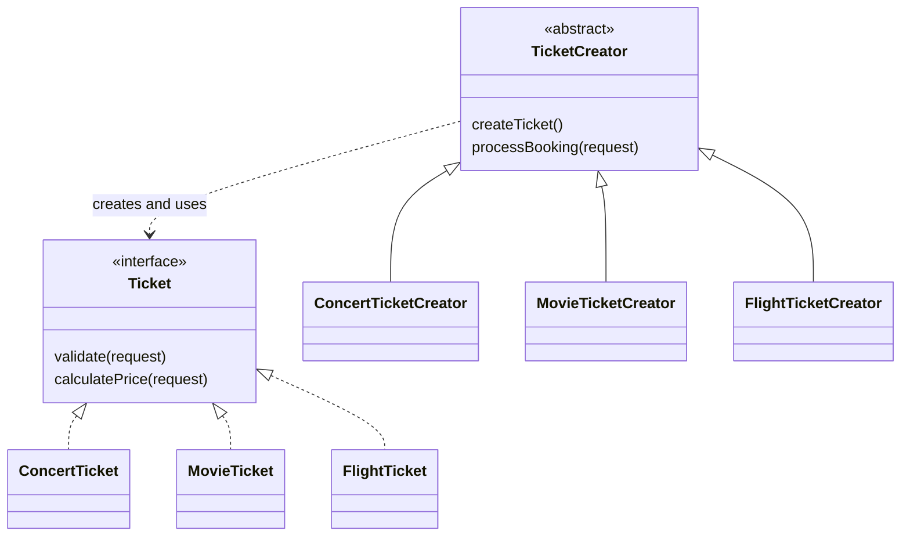
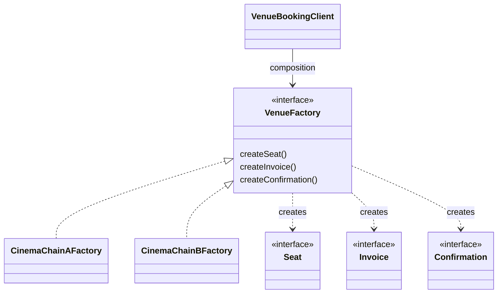

# Ticket Booking System

**Assignment 2: Factory Method and Abstract Factory**  
**Author:** Amir Kabdilmalik  
**Language:** Java 17+

## 1. Project idea

This project is a small ticket booking system that demonstrates two creational design patterns.

- **Part A - Factory Method:** creates one `Ticket` product. The available products are `ConcertTicket`, `MovieTicket`, and `FlightTicket`. Each product has different validation and pricing rules.
- **Part B - Abstract Factory:** creates a matching venue family containing a `Seat`, an `Invoice`, and a `Confirmation`. `CinemaChainAFactory` and `CinemaChainBFactory` create different but internally compatible families.

The main difference is that Factory Method creates **one product through inheritance**, while Abstract Factory creates **a family of products through composition**.

## 2. Project structure

```text
assignment2-ticket-booking/
├── src/
│   ├── app/
│   │   └── Main.java
│   ├── factorymethod/
│   │   ├── Ticket.java
│   │   ├── ConcertTicket.java
│   │   ├── MovieTicket.java
│   │   ├── FlightTicket.java
│   │   ├── TicketCreator.java
│   │   ├── ConcertTicketCreator.java
│   │   ├── MovieTicketCreator.java
│   │   ├── FlightTicketCreator.java
│   │   ├── BookingRequest.java
│   │   └── BookingReceipt.java
│   └── abstractfactory/
│       ├── Seat.java
│       ├── Invoice.java
│       ├── Confirmation.java
│       ├── VenueFactory.java
│       ├── CinemaChainAFactory.java
│       ├── CinemaChainASeat.java
│       ├── CinemaChainAInvoice.java
│       ├── CinemaChainAConfirmation.java
│       ├── CinemaChainBFactory.java
│       ├── CinemaChainBSeat.java
│       ├── CinemaChainBInvoice.java
│       ├── CinemaChainBConfirmation.java
│       ├── VenueBookingClient.java
│       └── VenuePackage.java
├── test/
│   └── PatternSmokeTest.java
├── .gitignore
└── README.md
```

## 3. Part A - Factory Method

### Product hierarchy

`Ticket` is the Product interface. It declares meaningful operations:

- `validate()` checks whether the booking data is valid.
- `calculatePrice()` applies the ticket's pricing rules.
- `describe()` returns booking details.

The three ConcreteProducts behave differently:

| Product | Validation | Pricing |
|---|---|---|
| `ConcertTicket` | Customer must be at least 16; zone must be STANDARD or VIP | VIP multiplier plus a service fee |
| `MovieTicket` | Customer must meet the movie age limit; seat must be REGULAR or PREMIUM | PREMIUM seat adds a fixed fee |
| `FlightTicket` | Valid route, travel class, baggage, and document number | Travel-class multiplier, tax, and excess-baggage fee |

### Creator hierarchy

`TicketCreator` is the abstract Creator. Its `createTicket()` method is the factory method. Its `processBooking()` business method creates a ticket and uses it only through the `Ticket` interface.

The ConcreteCreators are:

- `ConcertTicketCreator`
- `MovieTicketCreator`
- `FlightTicketCreator`

Only these creator subclasses call `new ConcertTicket()`, `new MovieTicket()`, or `new FlightTicket()`. The client in `Main` never creates a ConcreteProduct directly.

## 4. Part B - Abstract Factory

The related abstract products are:

- `Seat`
- `Invoice`
- `Confirmation`

`VenueFactory` is the AbstractFactory. It has one creation method for every product in the family:

```java
Seat createSeat();
Invoice createInvoice();
Confirmation createConfirmation();
```

The two ConcreteFactories are:

- `CinemaChainAFactory` - creates only Chain A products.
- `CinemaChainBFactory` - creates only Chain B products.

`VenueBookingClient` receives a `VenueFactory` in its constructor. This is composition. It knows only the factory and product interfaces, not the concrete Chain A or Chain B product classes.

### Why matching families matter

CinemaChainA uses seat IDs such as `A-R05-S12`, a compact `A-INVOICE`, and an A-QR confirmation. CinemaChainB uses seat IDs such as `B-Z2-045`, a multi-line Chain B receipt, and a B-PIN confirmation.

An A invoice cannot process a B seat ID and a B invoice cannot process an A seat ID. Each invoice checks the prefix and throws an exception if an incompatible seat is supplied. In normal use, this mismatch cannot happen because `VenueBookingClient` receives one factory and obtains all three objects from it.

The venue family is selected only once, in `Main.selectVenue()`. Changing A to B switches the whole product family.

## 5. Simplified class diagrams

### Factory Method



### Abstract Factory



## 6. How to compile and run

You need JDK 17 or newer. In the project folder, run:

### Windows PowerShell

```powershell
New-Item -ItemType Directory -Force out
javac -d out (Get-ChildItem -Recurse src -Filter *.java).FullName
java -cp out app.Main A
java -cp out app.Main B
```

### Windows Command Prompt

```bat
mkdir out
for /r src %f in (*.java) do @echo %f >> sources.txt
javac -d out @sources.txt
java -cp out app.Main A
java -cp out app.Main B
del sources.txt
```

If the commands are saved inside a `.bat` file, write `%%f` instead of `%f`.

### macOS or Linux

```bash
mkdir -p out
javac -d out $(find src -name "*.java")
java -cp out app.Main A
java -cp out app.Main B
```

Use `A` or `B` as the program argument to select the venue family. If no argument is given, Chain A is used.

### Run the smoke tests

After compiling the source files, compile and run the small no-framework test:

```bash
javac -cp out -d out test/PatternSmokeTest.java
java -cp out test.PatternSmokeTest
```

The test checks that invalid concert, movie, and flight requests are rejected and that each venue factory creates a consistent family. The successful result is `All smoke tests passed.`

## 7. Expected output

Example for venue A:

```text
PART A - FACTORY METHOD
Concert: Astana Live concert, VIP zone -> 18500.00 KZT
Movie: Design Patterns movie, PREMIUM seat -> 3500.00 KZT
Flight: Flight KC622 from Astana to Almaty, ECONOMY class -> 56400.00 KZT

PART B - ABSTRACT FACTORY
Venue: CinemaChainA
Seat: CinemaChainA row-and-seat numbering: A-R05-S12
A-INVOICE | Concert | Seat A-R05-S12 | Total 18500.00 KZT
CinemaChainA confirms Amir at A-R05-S12. Show the A-QR code at the entrance.
```

## 8. Assignment requirement checklist

| No. | Requirement | Implementation |
|---:|---|---|
| 1 | Product interface with meaningful method | `Ticket` has validation, pricing, description, and type methods |
| 2 | At least three ConcreteProducts | Concert, Movie, and Flight ticket classes |
| 3 | Abstract Creator plus business method | `TicketCreator.createTicket()` and `processBooking()` |
| 4 | At least three ConcreteCreators | Concert, Movie, and Flight creator classes |
| 5 | Client never constructs ConcreteProducts | Ticket construction exists only inside creators |
| 6 | At least two related abstract products | `Seat`, `Invoice`, and `Confirmation` |
| 7 | AbstractFactory with one method per product | `VenueFactory` has three creation methods |
| 8 | At least two ConcreteFactories | `CinemaChainAFactory` and `CinemaChainBFactory` |
| 9 | Client uses composition and interfaces | `VenueBookingClient(VenueFactory venueFactory)` |
| 10 | Family selected exactly once | `Main.selectVenue()` |

## 9. SOLID principles

### Open Closed Principle

The booking business method is closed for modification but open for extension. To add a new ticket type, for example `TrainTicket`, create `TrainTicket` and `TrainTicketCreator`. The existing `TicketCreator.processBooking()` method does not need to change.

For a new venue family, for example `CinemaChainC`, implement the existing product interfaces and add `CinemaChainCFactory`. The `VenueBookingClient` does not change.

### Single Responsibility Principle

Each class has one main responsibility:

- Ticket classes contain their own validation and pricing rules.
- Creator classes decide which ticket object to create.
- Concrete venue factories create compatible families.
- `VenueBookingClient` coordinates the use of a family.
- `Main` starts the demonstration and selects the venue once.

### Dependency Inversion Principle

`TicketCreator` depends on the `Ticket` abstraction. `VenueBookingClient` depends on `VenueFactory`, `Seat`, `Invoice`, and `Confirmation` abstractions instead of concrete classes.

## 10. Defense answers

### Where does the client stop depending on concrete product classes?

In Part A, `TicketCreator.processBooking()` uses the `Ticket` interface. `Main` creates a ConcreteCreator but never creates `ConcertTicket`, `MovieTicket`, or `FlightTicket` directly.

In Part B, `VenueBookingClient` receives `VenueFactory` in its constructor and uses only interface types. It does not import any concrete Chain A or Chain B product.

### What changes when a new ticket product is added?

I add one new class implementing `Ticket` and one new subclass of `TicketCreator`. The common booking algorithm in `processBooking()` remains unchanged. I may add the new creator to the application entry point so the user can select it.

### Why is Part A Factory Method?

It creates one product, `Ticket`. Creation is delegated to subclasses by overriding `createTicket()`. Therefore, it mainly uses inheritance.

### Why is Part B Abstract Factory?

It creates a related family of three products: `Seat`, `Invoice`, and `Confirmation`. One factory object is passed to the client, so it mainly uses composition. Switching the factory switches the whole family at once.

### What is the drawback?

Both patterns add more interfaces and classes. They are over-engineering if an application has only one fixed ticket type or one venue family and is very unlikely to grow.

### What is the weak point of Abstract Factory?

Adding a new family is easy, but adding a new kind of product is harder. For example, adding `SnackVoucher` requires a new method in `VenueFactory`, a new product interface, implementations for both Chain A and Chain B, and an update to the client that uses the family.

### Why is the mismatch a real bug?

The two chains use different seat identifiers and different invoice and entrance systems. An A invoice expects an ID beginning with `A-`; a B seat begins with `B-`. Mixing them would make invoice processing or entrance validation fail. The Abstract Factory prevents normal client code from creating this inconsistent combination.

## 11. Suggested honest Git commit history

Create the commits while you develop and verify the project. Do not claim commits you did not make. A useful sequence is:

```text
1. Create ticket product interface and booking data
2. Add concert movie and flight ticket behavior
3. Add Factory Method creator hierarchy
4. Add venue product interfaces and Chain A family
5. Add Chain B family and Abstract Factory client
6. Add demo README and cleanup
```

Example commands after each real stage:

```bash
git add .
git commit -m "Add Factory Method creator hierarchy"
```
